## Program Schedule

Thursday July 14, 2022 Pacific Time
TBD
<!--  
08:15–08:30 &nbsp;&nbsp;&nbsp; Opening Remarks
 
08:30–09:30 &nbsp;&nbsp;&nbsp; Invited Talk: 
 
09:30–10:30 &nbsp;&nbsp;&nbsp; Invited Talk: 
 
10:30–10:50 &nbsp;&nbsp;&nbsp; Break
 
10:50–11:00 &nbsp;&nbsp;&nbsp; Paper
 
11:00–11:10 &nbsp;&nbsp;&nbsp; Paper
 
11:10–11:20 &nbsp;&nbsp;&nbsp; Paper
 
11:20–11:30 &nbsp;&nbsp;&nbsp; Paper
 
11:30–12:30 &nbsp;&nbsp;&nbsp; Invited Talk:
 
12:30–13:30 &nbsp;&nbsp;&nbsp; Poster Presentation
 
13:30–14:30 &nbsp;&nbsp;&nbsp; Invited Talk:
 
14:30–14:40 &nbsp;&nbsp;&nbsp; Paper
 
14:40–14:50 &nbsp;&nbsp;&nbsp; Paper
 
14:50–15:00 &nbsp;&nbsp;&nbsp; Paper
 
15:00–15:10 &nbsp;&nbsp;&nbsp; Paper
 
15:10–15:20 &nbsp;&nbsp;&nbsp; Paper
 
15:20–15:30 &nbsp;&nbsp;&nbsp; Break
 
15:30–16:30 &nbsp;&nbsp;&nbsp; Invited Talk:
 
16:30–17:30 &nbsp;&nbsp;&nbsp; Invited Talk:
 
17:30–17:35 &nbsp;&nbsp;&nbsp; Closing remarks -->

## Invited Speakers

<table>
  <tbody>
    <tr>
      <td width="25%"><a href="http://www.cs.cmu.edu/~wcohen/">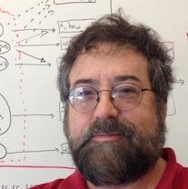</a></td>
      <td width="25%"><a href="http://blender.cs.illinois.edu/hengji.html">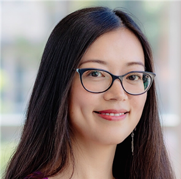</a></td>
      <td width="25%"><a href="https://lunadong.com/">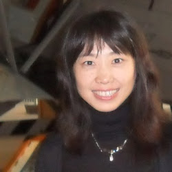</a></td>
      <td width="25%"><a href="https://cs.stanford.edu/people/jure/">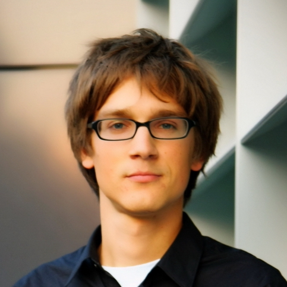</a></td>
    </tr>
    <tr>
      <td><a href="http://www.cs.cmu.edu/~wcohen/">William Cohen (Google)</a></td>
      <td><a href="http://blender.cs.illinois.edu/hengji.html">Heng Ji (UIUC)</a></td>
      <td><a href="https://lunadong.com/">Luna Dong (Facebook)</a></td>
      <td><a href="https://cs.stanford.edu/people/jure/">Jure Leskovec (Stanford)</a></td>
    </tr>
    <tr>
      <td width="25%"><a href="https://eisenjulian.github.io/">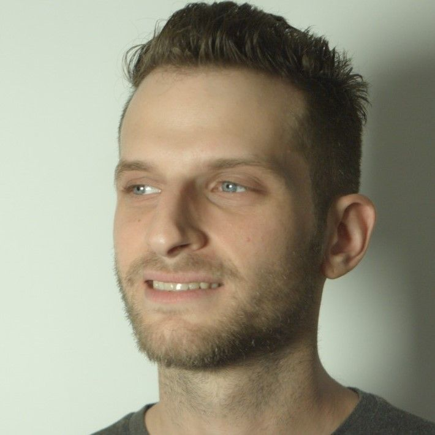</a></td>
      <td width="25%"><a href="https://homes.cs.washington.edu/~hannaneh/">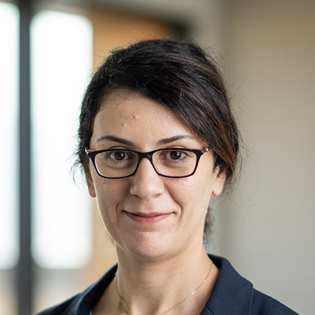</a></td>
      <td width="25%"></td>
      <td width="25%"><a href="http://www.cs.tau.ac.il/~joberant/">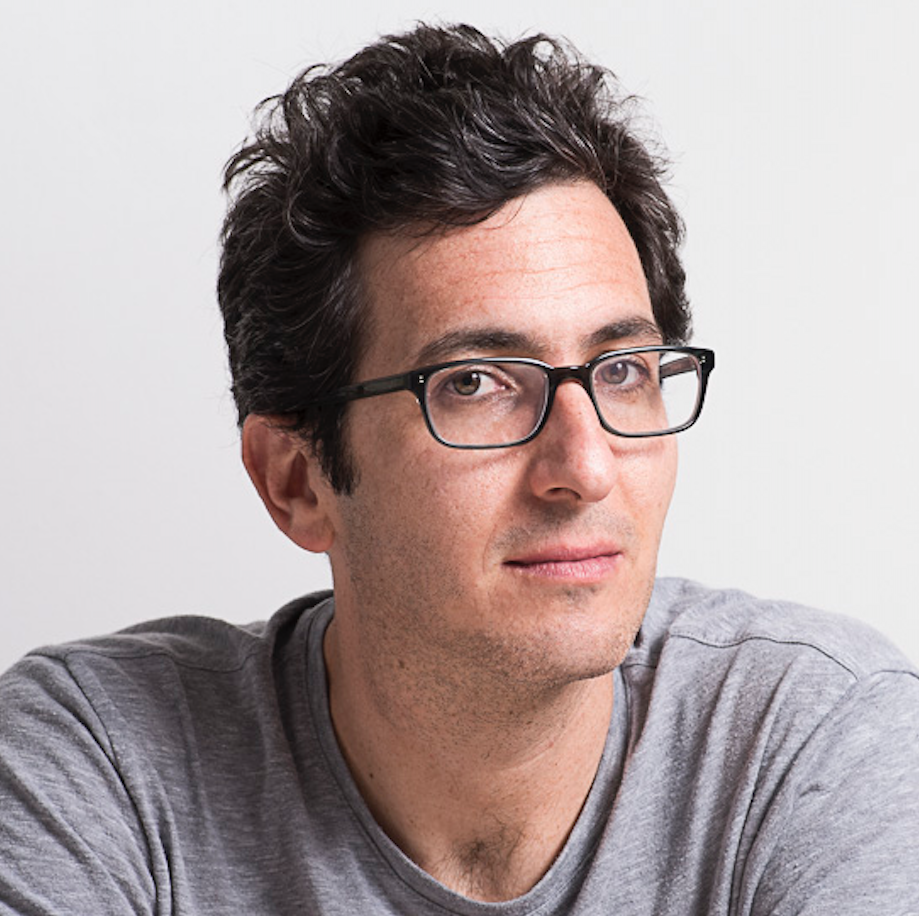</a></td>
    </tr>
    <tr>
      <td><a href="https://eisenjulian.github.io/">Julian Eisenschlos (Google)</a></td>
      <td><a href="https://homes.cs.washington.edu/~hannaneh/">Hanna Hajishirzi (University of Washington)</a></td>
      <td><a href="https://cs.stanford.edu/~pliang/"> Percy Liang (Stanford)</a></td>
      <td><a href="http://www.cs.tau.ac.il/~joberant/"> Jonathan Berant (Tel Aviv University/AI2)</a></td>
    </tr>
  </tbody>
</table>

## Organizing Committee

<table>
  <tbody>
    <tr>
      <td width="25%"><a href="https://wenhuchen.github.io/">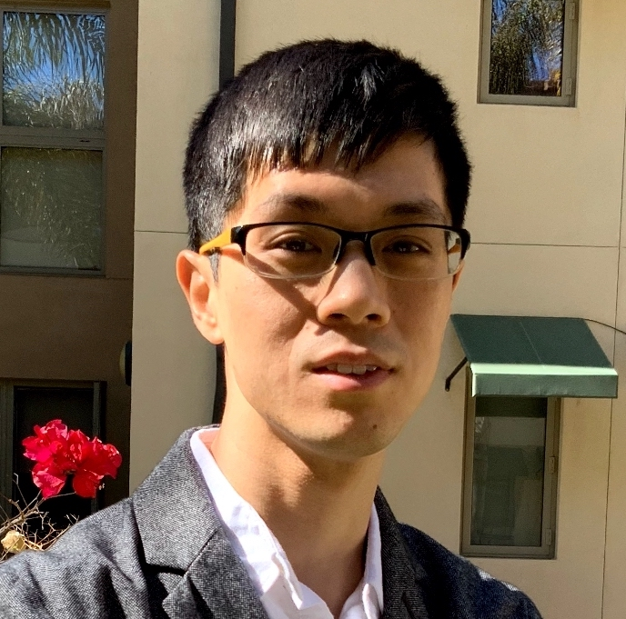</a></td>
      <td width="25%"><a href="https://jungyhuk.github.io/">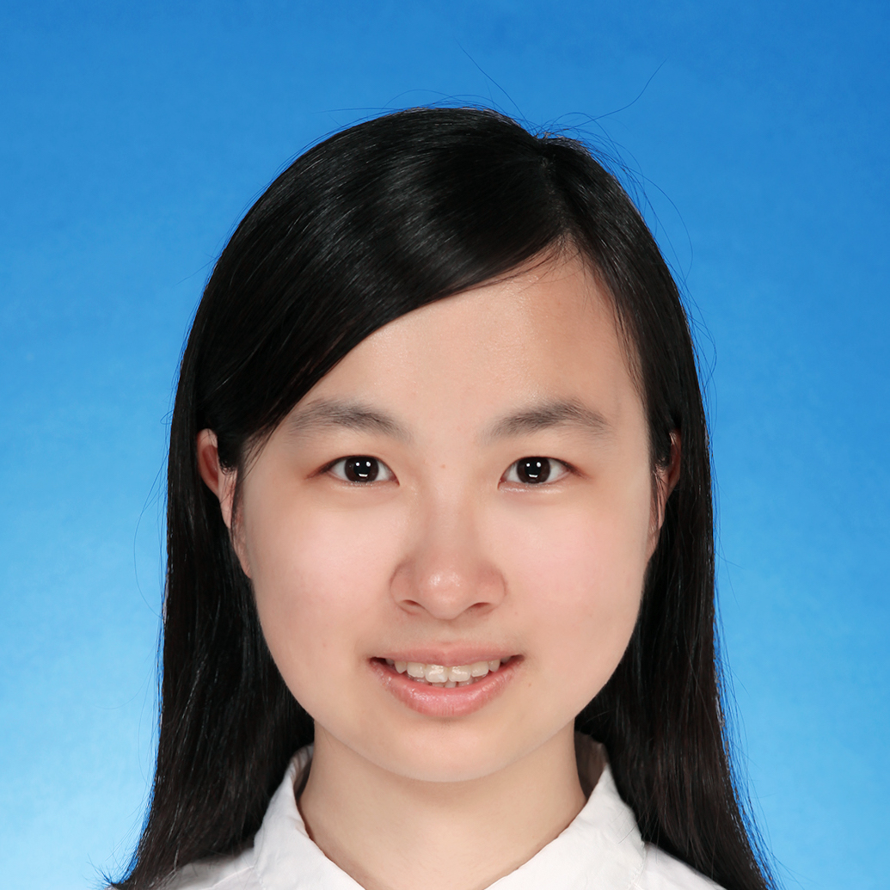</a></td>
      <td width="25%"><a href="https://czyssrs.github.io/">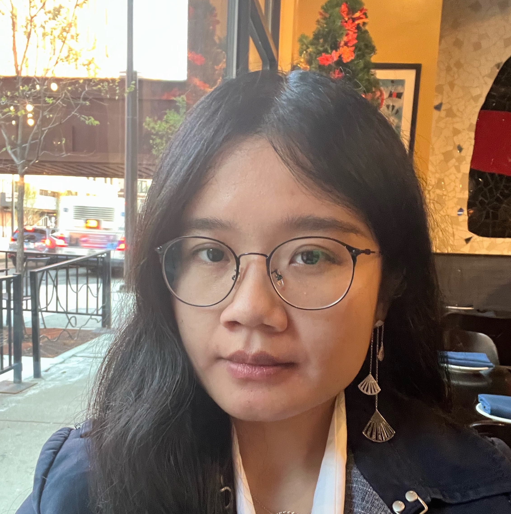</a></td>
      <td width="25%"><a href="https://ziyuyao.org/">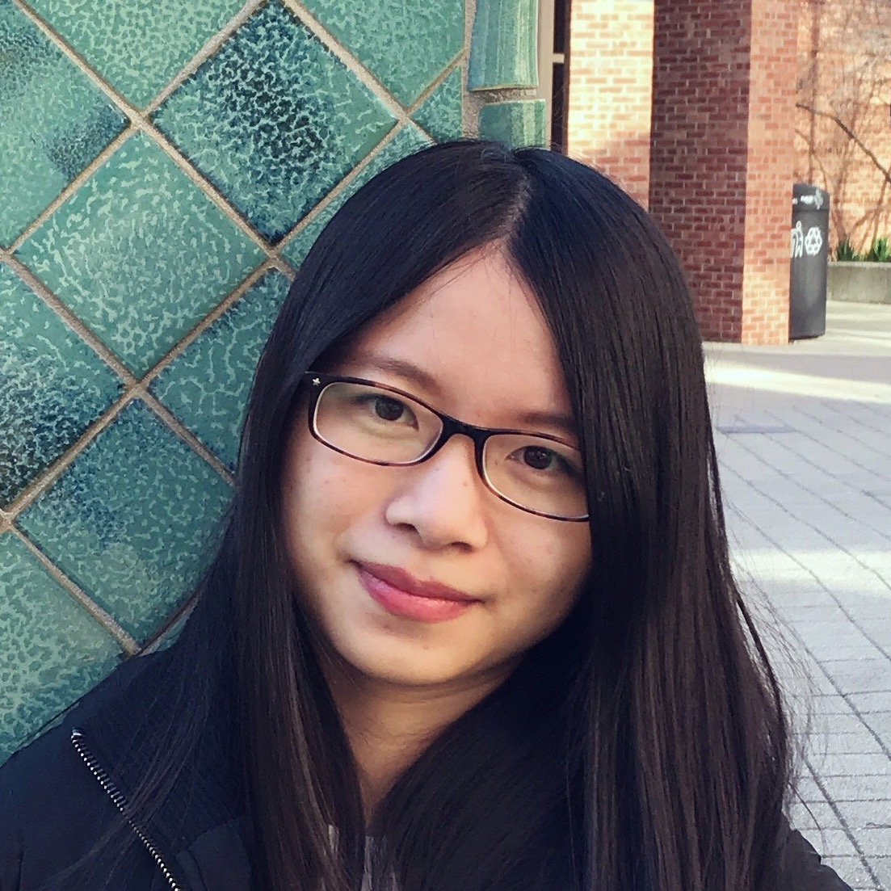</a></td>
    </tr>
    <tr>
      <td><a href="https://wenhuchen.github.io/">Wenhu Chen (Google/University of Waterloo)</a></td>
      <td><a href="https://jungyhuk.github.io/">Xinyun Chen (UC Berkeley)</a></td>
      <td><a href="https://czyssrs.github.io/">Zhiyu Chen (Facebook)</a></td>
      <td><a href="https://ziyuyao.org/">Ziyu Yao (George Mason University)</a></td>
    </tr>
    <tr>
      <td width="25%"><a href="https://cs.stanford.edu/~myasu/">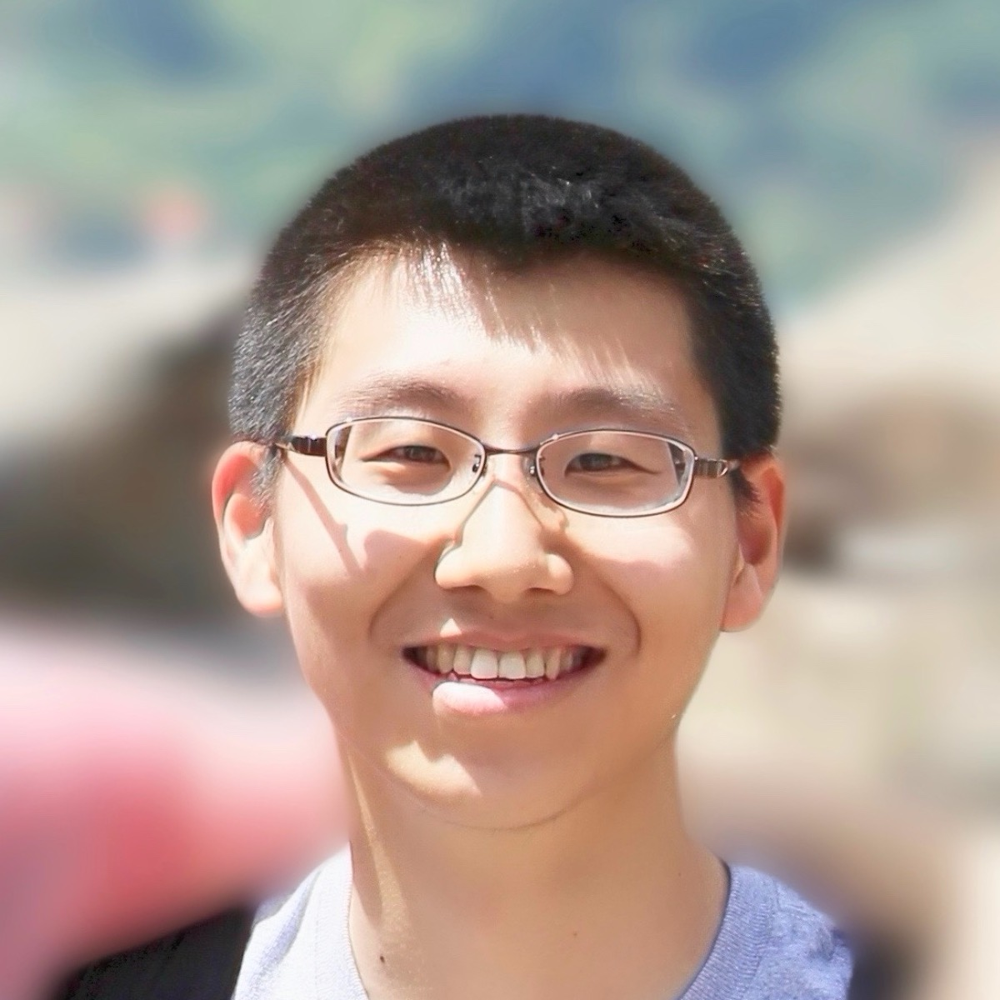</a></td>
      <td width="25%"><a href="https://taoyds.github.io/">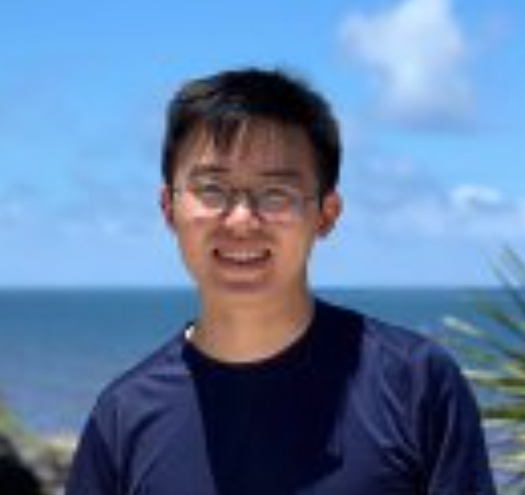</a></td>
      <td width="25%"><a href="https://ryanzhumich.github.io/">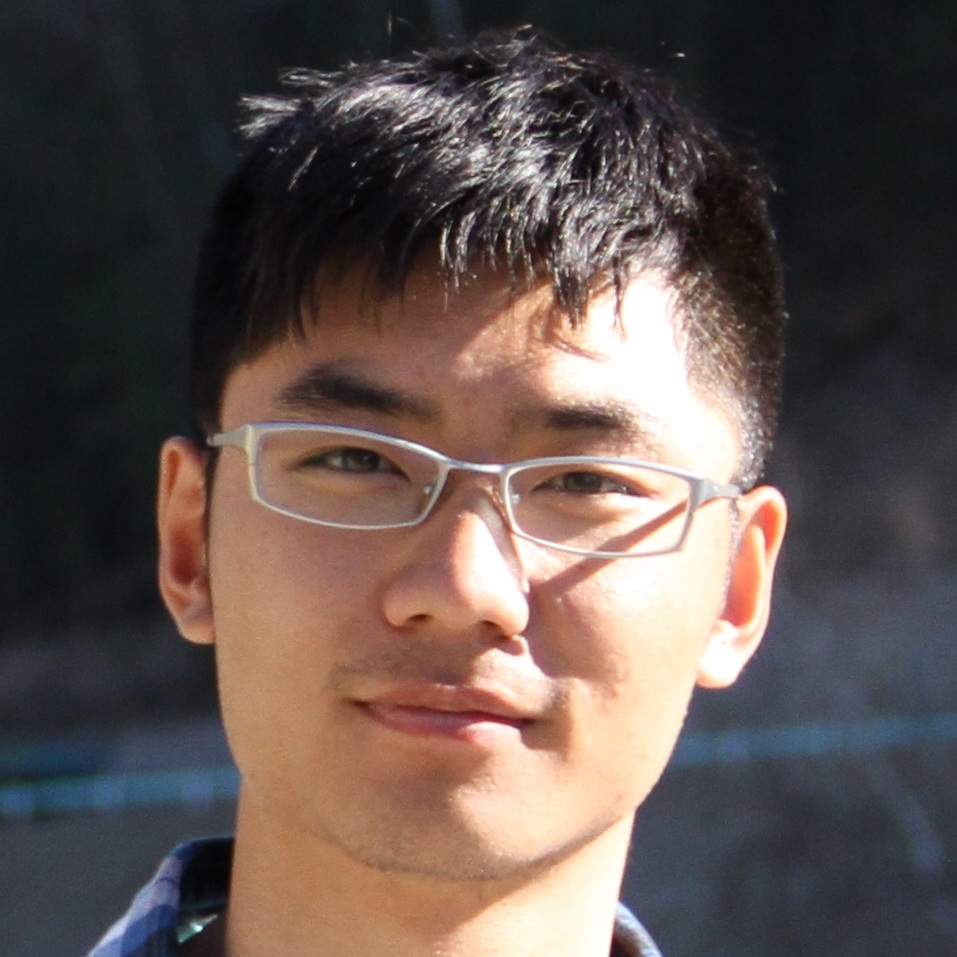</a></td>
    </tr>
    <tr>
      <td><a href="https://cs.stanford.edu/~myasu/">Michihiro Yasunaga (Stanford)</a></td>
      <td><a href="https://taoyds.github.io/">Tao Yu (University of Washington/University of Hong Kong)</a></td>
      <td><a href="https://ryanzhumich.github.io/">Rui Zhang (Penn State University)</a></td>
    </tr>
  </tbody>
</table>

## Sponsors
<!--  -->
<!--  -->
<!--  -->
